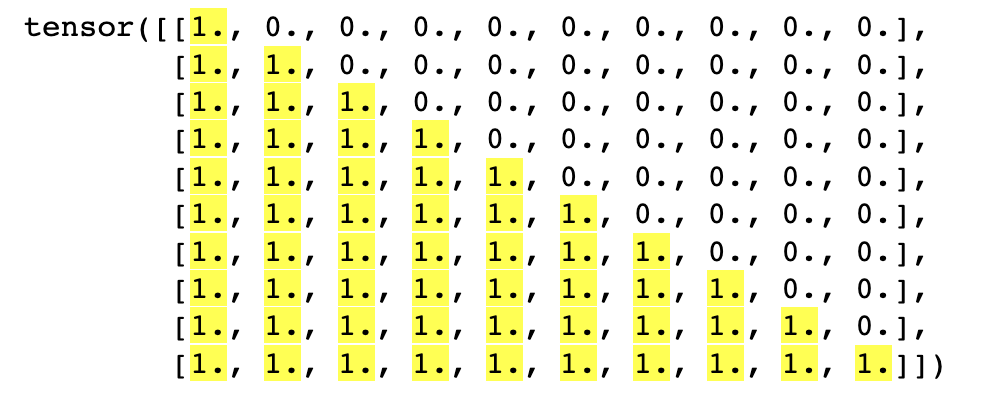
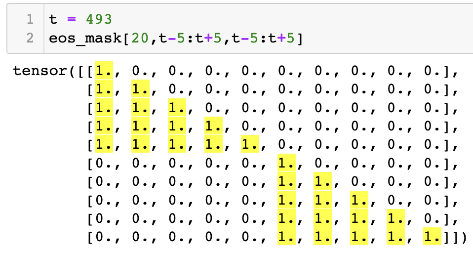
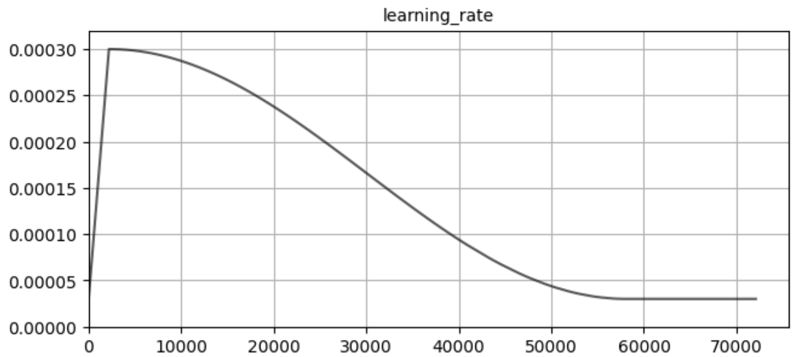
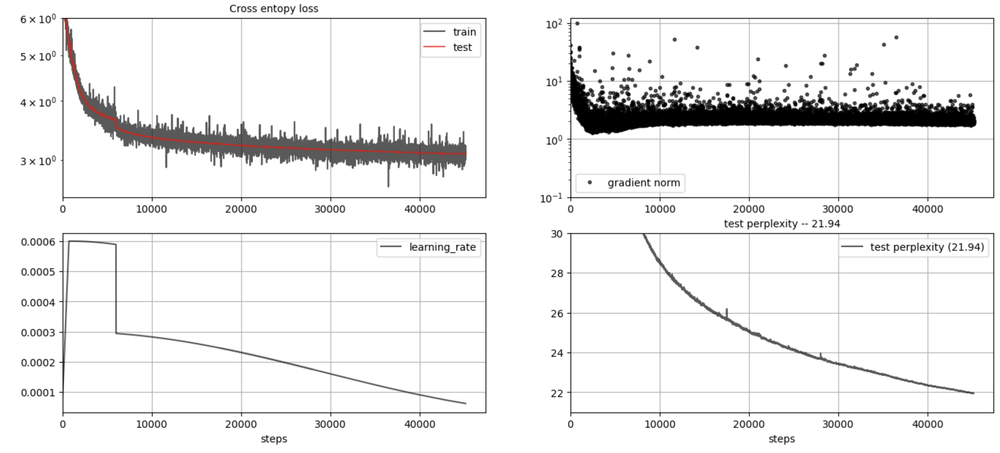
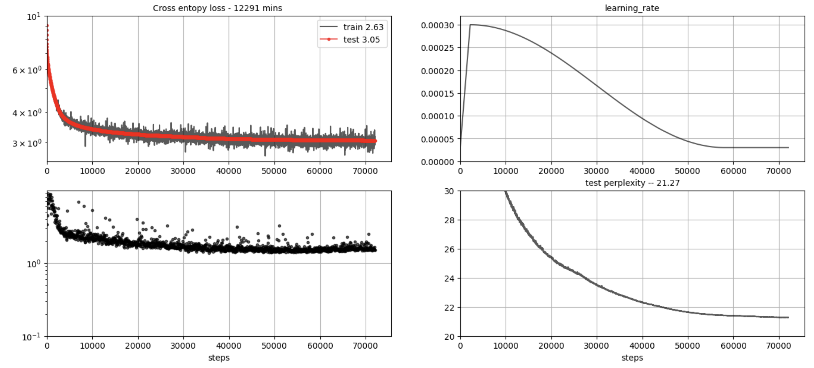

# OUTLINE
## 1. Model

The autoregressive language model was built from scratch using PyTorch, with multi-GPU support provided by the DDP module.

I utilized an NVIDIA DGX-1 machine equipped with **8 V100 GPUs**, each one boasting **32 GB RAM** with a system memory of **512 GB**. This configuration was just sufficient to accommodate a 1 billion parameter model and still retain some memory for loading training data batches. In comparison, training a more compact 304 million parameter model was more manageable. The smaller model size offered more memory to be available for training batches, reducing the reliance on gradient accumulation.

Clipping the gradients at 1.0 allowed the optimizer to control the size of the SGD step, preventing the optimization process from momentarily diverging and causing the training loss to spike.

### Autoregressive Mask

The self-attention mask for a contiguous sequence of tokens

### Positional Encodings

## 2. Dataset
After some initial experiments with the _tiny_shakespeare_ dataset (approximately 300K tokens), the Google News dataset (approximately 3B tokens), and crawling Wikipedia pages on-the-fly during training in a breadth-first manner—which proved to be unduly slow and cumbersome—I decided to use the OpenWebText2 dataset for both training and testing the model. This dataset was provided in the `np.memmap` format and stored on the disk. Memory-mapped files facilitate accessing small segments of large files on disk without loading the entire file into memory, enabling efficient GPU memory utilization.

The OpenWebText2 dataset comprises approximately 9B tokens (or 17GB on disk), primarily sourced from Reddit discussion pages. It's deduplicated based on the URLs from which the content was derived. The dataset consists of concatenated text pages, each separated by `<endoftext>` tokens. I had to adjust the autoregressive self-attention mask to ensure the model wouldn't attend to content from a preceding page.

### Tokenizer
OpenAI's tiktoken tokenizer was used tokenize and prepare the input text data. The tiktoken tokenizer has 50,257 tokens and it was used in developing GPT-2 and GPT-3 models.

## 3. Hyperparameters
### Learning Rate
The learning rate scheduler was made of a linear warmup phase and a cosine annealing phase. 

The learning rate starts at 10% of its maximum value and increases to the maximum over the first `x0` tokens. After that, between the `x0` and `x1` tokens, it's reduced following a cosine-shaped curve.

The hyperparameters were derived from those presented in the GPT-3 paper

## 3. Training and Inference

During training, the model parameters and optimizer state were saved every 2,000 SGD steps. This allowed me to backtrack to the most recent checkpoint, adjust hyperparameters, and restart training from that point if training loss diverged. One complete epoch of the OpenWebText dataset consisted of approximately 18,000 SGD steps. The batch_size was determined by the total number of tokens summed across all samples in all batches across all GPUs, before a single SGD update was made. I employed gradient accumulation since I mainly used a batch_size of 0.5M tokens which would not fit into GPU memory. Essentially, the `loss.backward()` method computes gradients and stores them at each parameter's gradient op until the entire batch has been processed. Then a simple `optimizer.step()` computes the delta weights and updates the parameters.

## 3.1. 1B parameter model
| d_model  | n_layers | n_heads | d_head | context_length | batch_size | acc_batch_size | learning_rate |
| :--------: | :--------: | :--------: | :--------: | :--------: | :--------: | :--------: | :--------: |
|   1728  |    24    |    18   |   96   |      128       |    140   (20/GPU)    |     734720     |    2.20e-04   |
|         |          |         |        |                |                      |                |               |

<pre>
tokenizer: gpt2  
CUDA_VISIBLE_DEVICES = 1,2,3,4,5,6,7 
num_params: 1.034 B 
world_size: 7 
batch_size: 140 
context_length: 128 
batch_jump: 17920 
x0: 1.125e9 
x1: 30e9 
clip: 1.00 
acc_batch_size: 734720 
num_chunked_batches: 41 
step_init: 0 
num_tokens_init: 0 
q_init: 0 
</pre>

## 3.2. 304 M parameter model

| d_model  | n_layers | n_heads | d_head | context_length | batch_size | acc_batch_size | learning_rate |
| :--------: | :--------: | :--------: | :--------: | :--------: | :--------: | :--------: | :--------: |
|   1024  |    16    |    16   |   64   |      256       |    252   (36/GPU)    |     516096     |    3.00e-04   |
|         |          |         |        |                |                      |                |               |

<pre>
tokenizer: gpt2
CUDA_VISIBLE_DEVICES = 1,2,3,4,5,6,7
num_params: 304 M 
models/chkpt_22000.pt
world_size: 7
batch_size: 252
context_length: 256
batch_jump: 64512
x0: 1.125e9
x1: 30e9
clip: 1.00
acc_batch_size: 516096
num_chunked_batches: 8
step_init: 22000
num_tokens_init: 11354112000
q_init: 22000
</pre>

## 3.3. 89 M parameter model

| d_model  | n_layers | n_heads | d_head | context_length | batch_size | acc_batch_size | learning_rate |
| :--------: | :--------: | :--------: | :--------: | :--------: | :--------: | :--------: | :--------: |
|   512  |    12    |    8   |   64   |      256       |    490   (70/GPU)    |     501760     |    6.00e-04   |
|         |          |         |        |                |                      |                |               |

<pre>
tokenizer: gpt2
CUDA_VISIBLE_DEVICES = 1,2,3,4,5,6,7
num_params: 89 M
world_size: 7
batch_size: 490
context_length: 256
batch_jump: 125440
x0: 1.125e9
x1: 30e9
clip: 1.00
acc_batch_size: 501760
num_chunked_batches: 4
step_init: 0
num_tokens_init: 0
q_init: 0
</pre>

